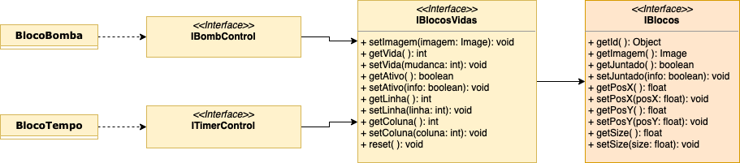
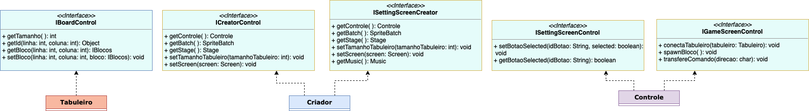
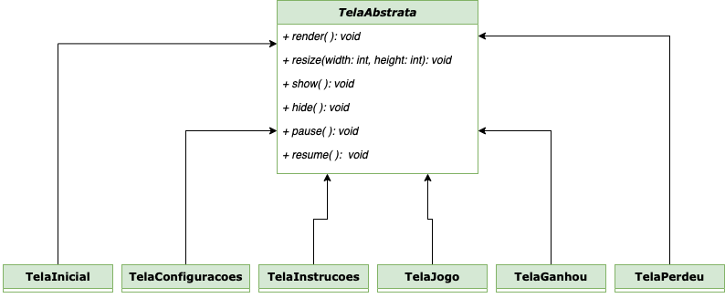
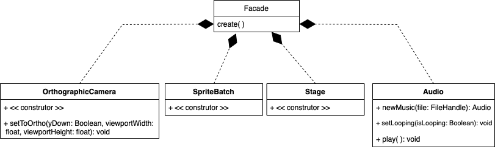

# Jogo 2048
Nos inspiramos no jogo 2048 pois acreditamos que ele teria o potencial para desenvolvermos um jogo que é inteligível em sua jogabilidade, mas que ofereceria diversos desafios para que fosse desenvolvido.

O jogo é formado por um tabuleiro, onde blocos são gerados em posições aleatórias a cada rodada. O papel do jogador é juntar blocos de números iguais e conseguir alcançar o bloco de número 2048, sem deixar o tabuleiro ser completamente preenchido.

Na nossa versão do jogo foram criados blocos especiais, que podem ser selecionados previamente e que servem para dinamizar ainda mais a gameplay, oferecendo desafios adicionais para o jogador. Também é possível selecionar o tamanho do tabuleiro desejado, para que o jogador possa customizar o jogo à sua preferência.


## Equipe
* `Luigi Mello Rigato` - `247248`
* `Raphael Ferezin Kitahara` - `244839`

## Arquivo Executável do Jogo
> [arquivo github](2048.jar)
>
> [google drive](https://drive.google.com/file/d/1i9GrHzZoogG3aWtwO08b4Cybgek3g0Mo/view?usp=sharing)

## Slides do projeto

### Slides da prévia
> [slides da prévia](https://www.canva.com/design/DAFBkFfnESE/NaXgOqQKhrpLeGiPTONJdQ/view?utm_content=DAFBkFfnESE&utm_campaign=designshare&utm_medium=link&utm_source=homepage_design_menu)

### Slides da Apresentação Final
> [slides da apresentação final](https://www.canva.com/design/DAFE2QOQieI/DgoEiCKvg8lAzDl2039lpw/view?utm_content=DAFE2QOQieI&utm_campaign=designshare&utm_medium=link&utm_source=homepage_design_menu)

### Relatório de Evolução
A ideia do jogo começou com a gente procurando no celular um jogo que conhecessemos bem, enxergássemos viabilidade de programá-lo e gostássemos bastante, de modo que o esforço do trabalho fosse um divertimento a cada conquista e não um sacrifício a cada bug. Então achamos o 2048! A estrutura que imediatamente pensamos para o jogo original era simples, já que não havia blocos especiais, apenas numéricos que dobravam até chegar em 2048. Haveria apenas uma interface IBlocos, uma classe Tabuleiro, uma Blocos, uma Controle, uma Montador e as classes relacionadas ao framework. Para a escolha deste, ouvimos os nossos amigos falando sobre o [LibGDX](https://libgdx.com/), ótimo e completo para desenvolvimento em Java com um tutorial de qualidade no próprio site. Até aí, o projeto parecia simples e começou bem, até que terminamos em menos de um dia as 4 principais classes do programa. Faltava algo; bugs, dificuldades, madrugadas viradas com café e lágrimas NÃO ESTAVAM APARECENDO e estávamos frustados com isso, porque é isso que queremos como programadores: bugs para resolver e debugar para que a vitória venha sofrida!
 Até que começamos a planejar os blocos especiais e cada ideia maluca de funcionalidade nova vinha atrelada a uma nova classe, novas interfaces e relação com design pattterns! Alguns blocos especiais, como o Deleta e o Dobro, foram mais tranquilos, pois já se enquadravam à estrutura do jogo. Outros blocos, como o Bomba e o Tempo, tomaram sozinhos 60% do esforço do trabalho inteiro e 90% dos bugs impossíveis, pois antes não era necessário monitorar as vidas e as coordenadas de cada bloco, (a ser continuado...)


## Destaques de Código
### Movimentação
É a função que realiza as movimentações no jogo. Tem uma seção inicial que é responsável pelas animações e alterações gráficas e, depois, segue para uma segue para uma sequência de condições para cada tipo de movimentação possível. Destaca-se, também, o uso de recursão entre funções responsáveis pela movimentação, como no primeiro caso, explicitado abaixo.

```java
private void movimenta(char direcao, int linhaIni, int colunaIni, SpriteBatch batch, Stage stage)
{
	// animação - parte que define as posições em que as imagens devem ser posicionadas e cria uma sequência para a animação dos blocos
	...

	// quando está vazio na frente, livre para continuar se movendo
	if(Objects.equals(board.getId(linhaFim, colunaFim), 0))
	{
		// nesse caso, pegamos o bloco da posição inicial e o transferimos para a posição final, já que ela era vazia e comocamos um bloco vazio na posição inicial
		board.setBloco(linhaFim, colunaFim, board.getBloco(linhaIni, colunaIni));
		board.getBloco(linhaIni, colunaIni).getImagem().addAction(animaBloco); // responsável por animar a transição
		board.setBloco(linhaIni, colunaIni, new BlocoGenerico(0));
		// há o uso de recursão através do chamado da função interpretaComando, que chamará, novamente, a função movimenta, até que o bloco encontre outro ou a parede do tabuleiro
		interpretaComando(direcao, linhaFim, colunaFim, batch, stage);

		algoMudou = true; 
		// variável que serve de controle para, caso não haja nenhum movimento quando o jogador fizer uma jogada, não serem spawnados novos blocos
	}

	// quando ambos os blocos são iguais e podem se juntar
	else if(Objects.equals(board.getId(linhaFim, colunaFim), board.getId(linhaIni, colunaIni)))
	{
		board.getBloco(linhaFim, colunaFim).getImagem().addAction(Actions.removeActor()); // removendo a imagem do bloco de destino (já que ele vai ser substituido por seu dobro)
		if(board.getBloco(linhaFim, colunaFim) instanceof BlocoGenerico)
		{
			((BlocoGenerico) board.getBloco(linhaFim, colunaFim)).dobra(); // método que dobra o número do bloco
		}
		board.getBloco(linhaIni, colunaIni).getImagem().addAction(animaBloco);
		board.setBloco(linhaIni, colunaIni, new BlocoGenerico(0));
		board.getBloco(linhaFim, colunaFim).setJuntado(true);
		algoMudou = true;
	}
	...
}
```

### Uso de Object
Para cada bloco foi designado um id específico, que o caracterizaria e permitiria que realizássemos ações relacionadas a ele (ex: juntar dois blocos de número 4, que teriam o mesmo id = 4).
No início, quando tínhamos apenas blocos numéricos, o id era definido como int, mas, ao adicionarmos os blocos especiais, observamos que não seria intuitivo designarmos um número genérico para os blocos bomba, deleta e tempo.
A solução foi implementarmos o id como um Object, fazendo com que pudéssemos continuar usando os inteiros com ids, para os blocos numéricos, e, também, implementar Strings que identificassem cada bloco especial.

```java
public Object getId(); // cada bloco tem o seu ID, algo que o identifique, podendo ser uma String, int, ...
```


## Destaques de Orientação a Objetos
### Herança de interfaces
No projeto, a herança de interfaces foi largamente utilizada para a definição das interfaces dos blocos, já que cada classe de blocos teria que implementar métodos gerais a todos os blocos e alguns específicos às suas características.



```java
// interface geral a todos os blocos
public interface IBlocos
{
    public Object getId(); // cada bloco tem o seu ID, algo que o identifique, podendo ser uma String, int, ...
    public Image getImagem();
    public boolean getJuntado();
    public void setJuntado(boolean info);
    public float getPosX();
    public void setPosX(float posX);
    public float getPosY();
    public void setPosY(float posY);
    public float getSize();
    public void setSize(float size);   
}

// interface que se refere aos blocos timer e bomba (que possuem "vida" que diminui até sumirem ou explodirem
public interface IBlocosVidas extends IBlocos
{
	...
}

// interfaces referentes a cada um dos blocos que possuem "vida", que foram criadas para que pudéssemos obter instâncias de cada um deles de maneira separada
public interface IBombControl extends IBlocosVidas
{}
public interface ITimerControl extends IBlocosVidas
{}
```

### Interfaces
Foram criadas algumas interfaces mais específicas para que pudéssemos implementar um filtro de visão de outras classes em relação ao controle. Isso fica evidente, por exemplo, na interface IGameScreenControl, que filtra os métodos do Controle que a TelaJogo pode acessar.
Além das classes de telas, também utilizamos esse método de criação de interfaces para as conexões entre as classes Tabuleiro e Controle e entre o Controle e o Criador.



```java
// exemplos de interfaces para telas
public interface IGameScreenControl
{
    public void conectaTabuleiro(Tabuleiro tabuleiro);
    public void spawnBloco();
    public void transfereComando(char direcao);
    public boolean getGanhou();
    public void setGanhou(boolean b);
}

public interface ISettingScreenControl
{
    public void setBotaoSelected(String idBotao, boolean selected);
    public boolean getBotaoSelected(String idBotao);
}


// exemplo de interface que realiza o filtro entre Controle e Tabuleiro
public interface IBoardControl
{
    public int getTamanho();
    public Object getId(int linha, int coluna);
    public IBlocos getBloco(int linha, int coluna);
    public void setBloco(int linha, int coluna, IBlocos bloco);
}
```

### Classe abstrata
Criamos uma classe abstrata TelaAbstrata, que seria herdada por todas as outras telas do jogo. Dessa forma, seria possível definirmos os métodos requeridos pela interface Screen do LibGDX apenas uma vez e não teríamos que fazer um método render( ) diferente para cada uma das telas, por exemplo. Não tivemos tempo de finalizarmos toda essa estruturação, pois cada tela tinha suas especificidades de input e de visualização, mas esse seria um dos principais ajustes a serem feitos futuramente, para que as classes do View ficassem ainda melhor estruturadas.



```java
public abstract class TelaAbstrata extends Stage implements Screen
{
    protected TelaAbstrata()
    {
        super(new StretchViewport(400f, 400f, new OrthographicCamera()));
    }
    
    @Override
    public void render(float delta)
    {
        // limpar tela
        Gdx.gl.glClearColor(0.32f, 0.41f, 0.42f, 1);
        Gdx.gl.glClear(GL20.GL_COLOR_BUFFER_BIT);

        // métodos do stage
        super.act(delta);
        super.draw();
    }
    
    @Override
    public void resize(int width, int height)
    {
        getViewport().update(width, height, true);
    }
	  ...
}
```
## Destaques de Pattern
### Facade
Implementamos, na classe Criador, o método create( ), que se caracteriza como um facade, já que reúne diversas outras funções, próprias do LibGDX, em um bloco único, que age como uma “caixa preta” para a criação dos elementos visuais.
Em algumas telas, foi implementado, também, o método criaStage( ), que também é relacionado a criação de elementos da interface visual, reunindo diversas ações que são realizadas quando chamado.



```java
public void create()
{
    // criação da câmera, do batch e do stage
    camera = new OrthographicCamera();
    camera.setToOrtho(false, 500, 500);
    batch = new SpriteBatch();
    stage = new Stage(new StretchViewport(camera.viewportWidth, camera.viewportHeight));
    Gdx.input.setInputProcessor(stage);

    // criação do controle
    controle = new Controle(this);

    // fazendo o load da música de fundo e a iniciando
    music = Gdx.audio.newMusic(Gdx.files.internal("musicas/Corona-320bit.mp3"));
    music.setLooping(true);
    music.play();
 
    // definindo a tela como tela inicial
    this.setScreen(new TelaInicial(this));
}
```

### Singleton
> Explicação e detalhamentos.

DIAGRAMA

```java
código
```

## Conclusões e Trabalhos Futuros
Consideramos que o projeto foi bem sucedido, pois foi possível implementar as funcionalidades que achávamos essenciais ao jogo e acreditamos que conseguimos estruturar o projeto bem.

A curva de aprendizado foi gigante, já que nunca havíamos implementado interface gráfica em nenhum programa e também nunca havíamos colaborado com outras pessoas em projetos mais complexos, como esse.

Como mencionado, não tínhamos experiência prévia com interface gráfica, mas desejávamos fazer uma que tivesse uma boa qualidade, já que ela tem uma grande influência na jogabilidade e na experiência de usuário, então utilizamos o framework libGDX para que tivéssemos um bom escopo para implementarmos o que tínhamos em mente. As animações foram a parte mais difícil do processo e estavam demandando tempo demais, enquanto ainda não tínhamos resolvido todos os bugs da lógica do jogo em si, então uma das principais melhorias, relacionadas a interface gráfica, seria animar melhor os blocos especiais (colocar animações melhores para as explosões e para o bloco tempo quando some) e melhorar as animações quando os blocos se movimentam sem se juntar, que ainda não estão prontas.

Seria adequado, também, como já mencionado no destaque da classe abstrata, compartimentar melhor as estruturas de cada tela e generalizá-las para que o uso da TelaAbstrata se torne mais eficiente.

Com relação ao jogo em si, poderiam ser criados, no futuro, novos blocos especiais, blocos  numéricos que vão além de 2048 (4096, 8192, …) para caso o jogador, ao chegar em 2048, desejasse continuar jogando e, queríamos, por fim, ter implementado um sistema de pontuação, que seria acompanhado de um ranking de jogadores.

## Diagramas

### Diagrama Geral da Arquitetura do Jogo
> [diagrama.pdf](diagrama.pdf)
